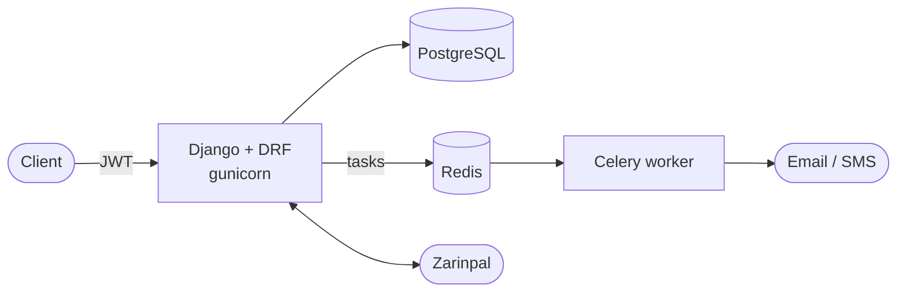

# Custom Shop

[](https://github.com/MohammadYR/Custom-Shop-Project/actions/workflows/ci.yml)
[](https://github.com/MohammadYR/Custom-Shop-Project/actions/workflows/codeql.yml)


[](LICENSE)

A **multi-vendor marketplace backend**: many sellers run their own stores
inside one shop, customers buy from several of them in a single order, and
staff manage everything from an admin panel and a REST API.

Built with Django 6.1, Django REST framework, PostgreSQL, Celery and Redis.

## Highlights

- **Marketplace model.** One product can be sold by many stores, each with its own price, discount and stock. A product page lists every offer, cheapest first.
- **Safe checkout.** Store items are locked with `SELECT … FOR UPDATE`, so two buyers can never oversell the last unit. Prices and the shipping address are frozen on the order.
- **Explicit state machines** for orders (`PENDING → PAID / CANCELLED`) and for each order line, which the seller moves through `SHIPPED → DELIVERED`. Cancelling returns stock exactly once, whether it comes from the API, the payment callback or the admin.
- **Payments** through Zarinpal with an idempotent verify callback: a repeated callback never charges or restocks twice.
- **Auth** with JWT (rotating refresh tokens) and passwordless login by one-time code over email or SMS, with expiry, attempt limits and rate limiting.
- **Soft delete everywhere** (HackSoft-style `BaseModel`), with unique constraints that ignore deleted rows.
- **Background work** in Celery: OTP delivery, order and low-stock emails with retries, scheduled cleanup.
- **Engineering:** 187 tests against PostgreSQL, CI with lint, tests, a Docker smoke test and CodeQL, a validated OpenAPI schema, and pre-commit hooks.

## Architecture



Domain apps (`accounts`, `catalog`, `marketplace`, `sales`, `payments`,
`reviews`) keep business rules in service functions. Views stay thin, and
expected failures surface as one consistent error format:
`{"detail": "...", "code": "cart_error"}`.
Details: [docs/architecture.md](docs/architecture.md).

## Quick start

### With Docker (everything)

```bash
git clone https://github.com/MohammadYR/Custom-Shop-Project.git
cd Custom-Shop-Project
cp .env.example .env            # set DJANGO_SECRET_KEY and DB_PASSWORD
docker compose up -d --build
docker compose exec web python manage.py createsuperuser
```

Open <http://localhost:8000/api/docs/> for Swagger UI and <http://localhost:8000/admin/> for the admin.

### For development

Requires [uv](https://docs.astral.sh/uv/) and Docker.

```bash
cp .env.example .env
uv sync                          # Python 3.14 + locked dependencies
docker compose up -d db redis    # PostgreSQL and Redis
uv run python manage.py migrate
uv run python manage.py runserver
uv run pytest                    # run the test suite
```

See [docs/development.md](docs/development.md) for workers, tests, linting and migrations.

## API at a glance

| Area | Endpoints |
| --- | --- |
| Auth | `POST /api/accounts/register/`, `login/`, `request-otp/`, `verify-otp/`, `token/refresh/` |
| Profile | `/api/myuser/`, `/api/myuser/address/`, `/api/myuser/register_as_seller/` |
| Catalog | `GET /api/products/?search=&category_slug=&min_price=&in_stock=&ordering=`, `/api/categories/`, `/api/stores/` |
| Cart & orders | `/api/mycart/`, `/api/mycart/add_to_cart/{store_item_id}/`, `POST /api/orders/checkout/`, `/api/myorders/` |
| Payments | `POST /api/payments/{order_id}/start/`, `GET /api/payments/verify/` |
| Seller area | `/api/mystore/`, `/api/mystore/items/`, `/api/mystore/orders/`, `/api/mystore/order-items/{id}/` |
| Staff | `/api/admin/users/`, `/api/admin/categories/`, `/api/orders/` |

Full guide with conventions, filters and a curl walkthrough: [docs/api.md](docs/api.md).

## Tech stack

| | |
| --- | --- |
| Language / framework | Python 3.14, Django 6.1, Django REST framework 3.18 |
| Data | PostgreSQL 18, Redis 8 |
| Async | Celery 5.6 (worker + beat) |
| Auth | SimpleJWT, OTP by email / Kavenegar SMS |
| Payments | Zarinpal |
| API docs | drf-spectacular (OpenAPI 3, Swagger UI, ReDoc) |
| Admin | Django admin with the Jazzmin theme |
| Tooling | uv, ruff, pytest, pre-commit, GitHub Actions, CodeQL, Dependabot |
| Runtime | Docker, gunicorn, WhiteNoise |

## Repository layout

```text
config/        settings (base / dev / test / prod), URL routing, Celery app
core/          BaseModel + soft delete, error handling, pagination, health check
accounts/      users, profiles, addresses, OTP, SMS
catalog/       categories, products, images, variants, search and filters
marketplace/   sellers, stores, store items (offers), seller area
sales/         cart, orders, checkout and state machines
payments/      payments, transactions, Zarinpal client
reviews/       product and store reviews
tests/         API, cross-app and regression tests
docs/          architecture, API, development and deployment guides
```

## Documentation

- [Architecture](docs/architecture.md): apps, layers, data model, state machines, checkout flow
- [API guide](docs/api.md): conventions, endpoint map, filters, errors
- [Development](docs/development.md): local setup, tests, code quality, migrations
- [Deployment](docs/deployment.md): Docker stack, production settings, go-live checklist
- [Changelog](CHANGELOG.md)
- Background: [code review notes](docs/REVIEW.md) and [course requirements coverage](docs/SPEC_COVERAGE.md)

## About

Started as the final project of the Maktab 130 Python/Django bootcamp, then
hardened and modernized: security review, PostgreSQL, Python 3.14 / Django
6.1, and a test suite that grew from 22 to 187 tests.

**به فارسی:** «کاستومی شاپ» بک‌اند یک فروشگاه اینترنتی چندفروشنده است. هر
فروشنده فروشگاه خودش را دارد، یک محصول می‌تواند توسط چند فروشگاه با قیمت و
تخفیف جداگانه فروخته شود، و پرداخت از طریق زرین‌پال انجام می‌شود. این پروژه
به‌عنوان پروژه‌ی نهایی بوت‌کمپ مکتب ۱۳۰ شروع شد و بعد بازبینی امنیتی شد و
به Python 3.14، Django 6.1 و PostgreSQL ارتقا یافت.

## License

[MIT](LICENSE)
