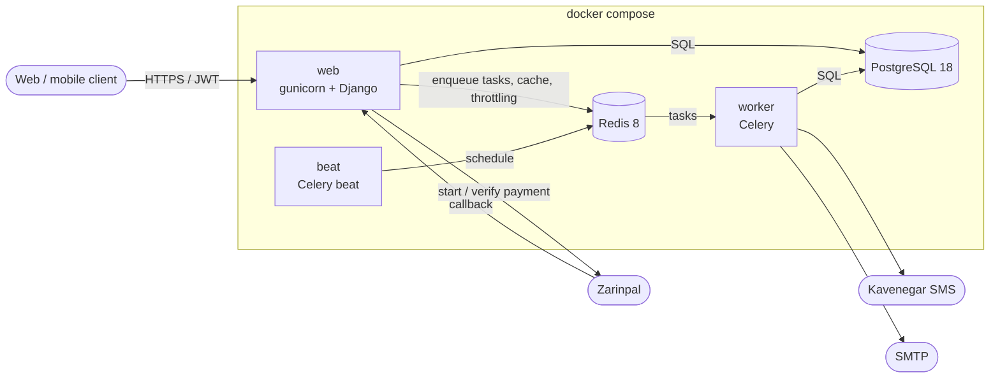
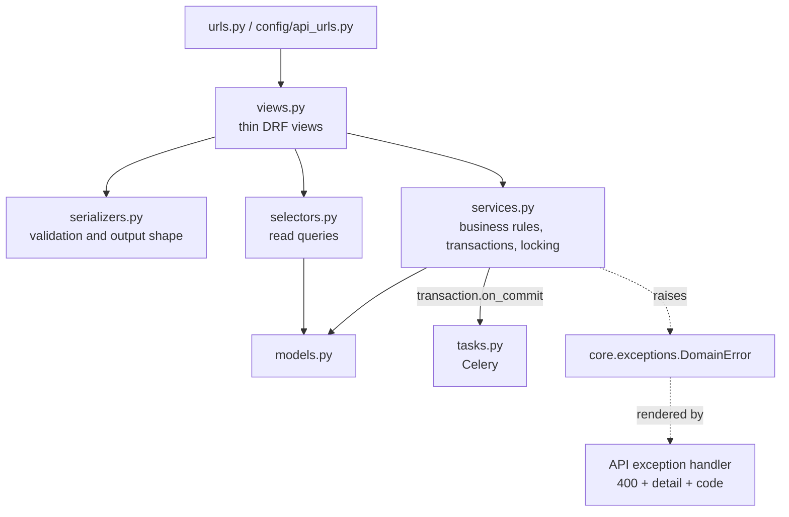
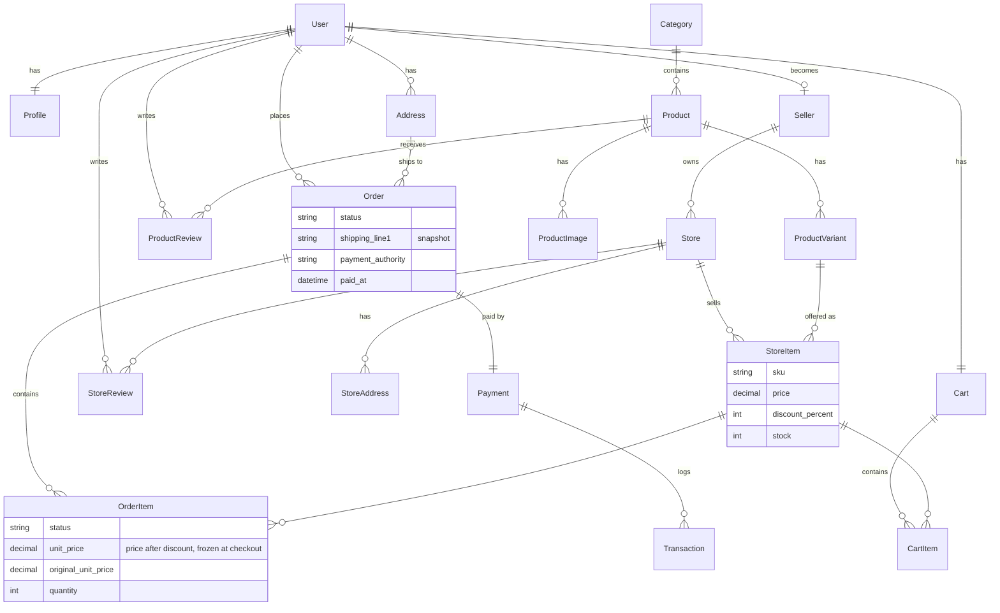
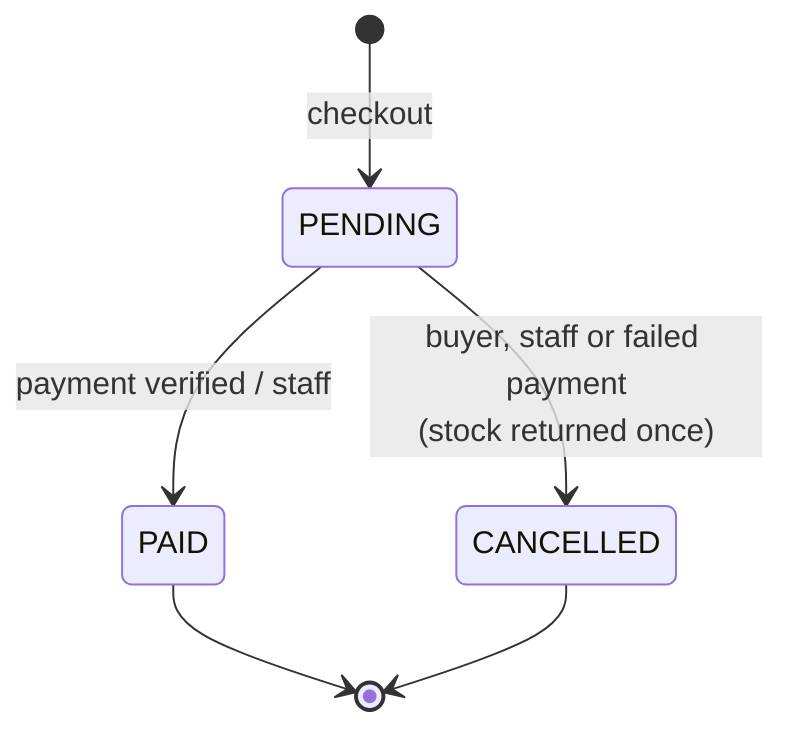
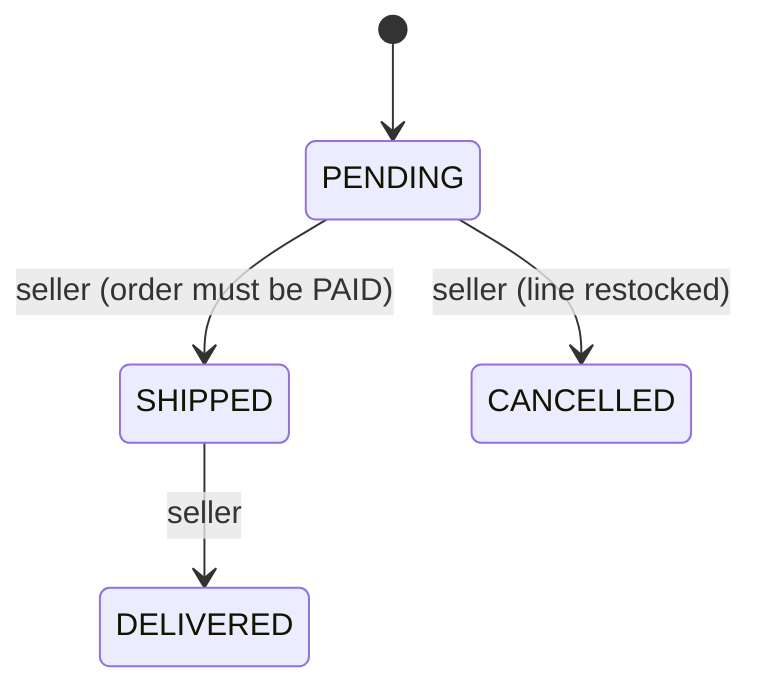
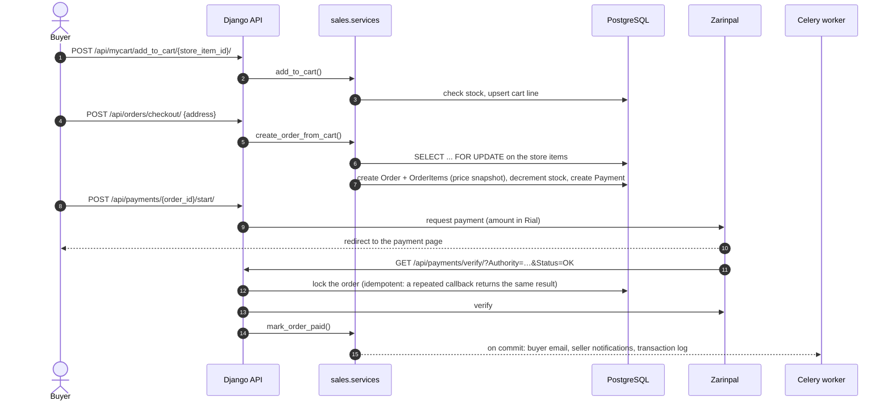

# Architecture

Custom Shop is a Django monolith split into domain apps. Each app owns its
models and exposes them through Django REST framework. Business rules live in
plain-Python **service functions**, not in views, serializers or signals.

## System overview



| Process | Role |
| --- | --- |
| `web` | gunicorn serving the Django app; WhiteNoise serves static files |
| `worker` | Celery worker: OTP delivery, order emails, low-stock alerts, payment logs |
| `beat` | Celery beat: hourly cleanup of expired OTPs |
| `migrate` | one-shot container that applies migrations before `web`/`worker` start |
| `db` | PostgreSQL 18 |
| `redis` | Celery broker and result backend, cache for rate limiting in production |

## Apps

| App | Owns | Notes |
| --- | --- | --- |
| `core` | `BaseModel`, soft delete, pagination, shared permissions, `DomainError` + API exception handler, health check | No business models |
| `accounts` | `User`, `Profile`, `Address`, `OTP` | Login by email / username / phone, OTP by email or SMS |
| `catalog` | `Category`, `Product`, `ProductImage`, `ProductVariant` | Search, filters and ordering (`catalog/filters.py`, `catalog/selectors.py`) |
| `marketplace` | `Seller`, `Store`, `StoreAddress`, `StoreItem` | A `StoreItem` is one store's offer for one product variant: price, discount, stock. Seller area under `/api/mystore/` |
| `sales` | `Cart`, `CartItem`, `Order`, `OrderItem` | Checkout and both state machines (`sales/services.py`) |
| `payments` | `Payment`, `Transaction` | Zarinpal client in `payments/gateway.py` |
| `reviews` | `ProductReview`, `StoreReview` | One review per user and target, rating 1–5 |
| `config` | settings, URL routing, Celery app | `config/api_urls.py` holds the public API paths |

### Layers inside an app



- **Views** parse the request, call one service and serialize the result.
  They do not catch business errors.
- **Services** contain the rules (stock, state transitions, OTP checks) and
  run them inside `transaction.atomic`, with row locks where needed. They raise
  `DomainError` subclasses (`CartError`, `CheckoutError`,
  `InvalidOrderTransition`, `OTPError`), each with a safe message and a
  machine-readable `code`.
- **Tasks** are queued with `transaction.on_commit`, so a worker never sees
  data from a transaction that was rolled back.
- **Signals** are used only for small side effects (profile and cart for a
  new user, lowercase username/email, one default address per user,
  low-stock alerts), not for business rules.

## Data model



`docs/ERD.png` is a full diagram generated from the models;
`docs/ERD_v1.pdf` is the original course design.

### BaseModel and soft delete

Every domain model except `User` extends `core.models.BaseModel`, following
the HackSoft Django Styleguide:

- UUID primary key, `created_at`, `updated_at`, `deleted_at`
- `objects` returns live rows only; `all_objects` includes deleted rows
- `delete()` sets `deleted_at`, `hard_delete()` removes the row, `restore()`
  brings it back
- unique constraints are conditional on `deleted_at IS NULL`, so a deleted
  category, store, SKU or review never blocks a new one

## Order lifecycle



Each order item also has a status that the seller controls:



Any other transition raises `InvalidOrderTransition` (HTTP 400,
`code: invalid_transition`). The API, the payment callback and the admin
actions all go through the same service functions.

## Checkout and payment flow



## Errors

Business-rule failures share one shape:

```json
{"detail": "Not enough stock for SKU-42.", "code": "cart_error"}
```

| `code` | Raised by |
| --- | --- |
| `cart_error` | adding to the cart or changing a quantity (inactive item, not enough stock) |
| `checkout_error` | checkout (empty cart, missing address, stock changed) |
| `invalid_transition` | order / order item status changes the state machine does not allow |
| `invalid_otp` | wrong, expired or used OTP, or too many attempts |

Validation errors keep DRF's standard per-field format.

## Security notes

- JWT access tokens (15 min) and rotating refresh tokens with a blacklist.
- Rate limits on register, login, OTP request and OTP verify.
- OTP codes come from `secrets`, expire, are single-use and allow 5 attempts.
  Neither codes nor recipients are logged.
- Ownership fields (`cart`, `store`, `owner`, `user`) are read-only in the
  API and set on the server.
- Production settings refuse to start without `DJANGO_SECRET_KEY` and
  `DJANGO_ALLOWED_HOSTS`, force HTTPS and HSTS, and never allow every CORS
  origin.
- CodeQL runs on every pull request; ruff's bandit rules (`S`) run in CI and
  in the pre-commit hook.
